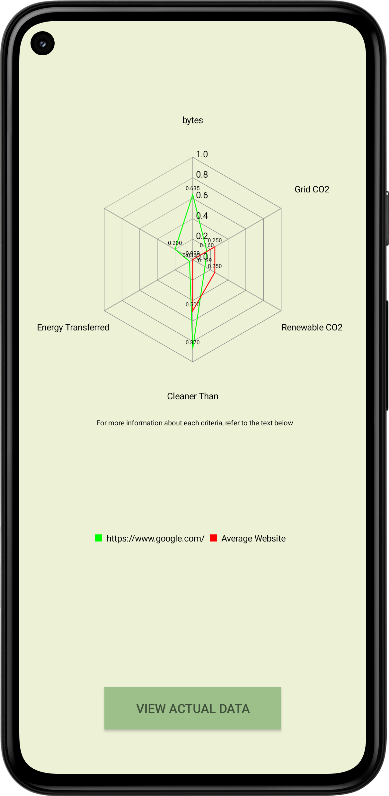
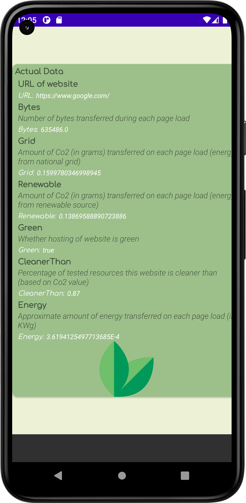

<h1> SustainWebable </h1>
<h2> Team Name: Cookie Clickers </h2>
<h3> Members </h3> 
<ul>
  <li>Parth Kumar</li>
  <li>Elisabeth Fung</li>
  <li>Reina Peh</li>
  <li>Andrea Cheah</li>
  <li>Mithunbalaji MG</li>
</ul>

<h3>Project Name: SustainWebable - Promoting Environmental Awareness in Web Development</h3>

<h3>Theme of Submission: Sustainability</h3>

<h3>Overview:</h3>

SustainWebable is an Android application that aims to make people and developers more aware of the environmental impact caused by their web activities. By leveraging the power of Google Firebase and integrating with the Website Carbon API, SustainWebable provides users with insights into the carbon emissions and environmental efficiency of websites. The application allows users to log in as either a Developer or a Non-Developer, catering to different target audiences.

<h3>Problem Addressed:</h3>

The target industry for SustainWebable is web development and the pain point it addresses is the lack of awareness among developers and non-developers regarding the environmental impact of their web activities. Many people are unaware that their web browsing habits, as well as the websites they create, contribute to carbon emissions and have an ecological footprint. SustainWebable aims to bridge this knowledge gap and encourage sustainable practices in web development.

<h3>Future Plans:</h3>

In the future, SustainWebable plans to expand its features and outreach to further promote environmental awareness in web development. Some of the planned enhancements include:

<ol>
  <li>Non-developer Account: Implementing a feature where non-developer users can gain detailed statistics about how their browsing history impacts the environment. This feature will provide insights into carbon emissions, bytes transferred, and other relevant information related to the environmental impact of their web activities.</li>
  <li>Environmental Recommendations: Offering personalized suggestions and recommendations to both developers and non-developers on how they can reduce their carbon footprint and adopt more eco-friendly practices in their web-related activities.</li>
  <li>Social Integration: Enabling users to share their environmental impact data, achievements, and awareness messages on social media platforms, thus creating a community-driven movement towards sustainability in web development.</li>
</ol>

<h3>Tech Stack Used:</h3>

To build the SustainWebable Android application, the team utilizes the following technologies:

<ol>
  <li>Android Studio: The primary Integrated Development Environment (IDE) for developing the Android application, utilizing Java and XML for coding the app's functionalities and UI.</li>
  <li>Google Firebase: A robust mobile and web application development platform that provides various services like authentication, database management, and cloud storage. Firebase is used for user authentication and data storage in SustainWebable.</li>
  <li>Website Carbon API: An API provided by https://websitecarbon.com, which calculates and provides information on the carbon emissions generated by a given website. SustainWebable integrates with this API to retrieve environmental impact data for websites entered by the users.</li>
  <li>Git/GitHub: Version control system and collaboration platform utilized for source code management, enabling seamless collaboration among team members and ensuring efficient development practices.</li>
</ol>

SustainWebable combines the power of these technologies to deliver an intuitive and informative Android application that raises awareness about the environmental impact of web activities, encourages sustainable practices in web development, and provides users with insights into the environmental efficiency of websites.

<h3>Metrics used to analyse a website</h3>
<ul>
  <li>Bytes: Number of bytes transferred during each page load</li>
  <li>Grid: Amount of Co2 transferred (in grams) on each page load (energy from national grid)</li>
  <li>Green: Whether the hosting of the webiste is considered as "green"</li>
  <li>CleanerThan: Percentage of tested resources this website is cleaner than (based on Co2 value)</li>
  <li>Energy: Approximate amount of energy transferred on each page load (in KWg)</li>
</ul>

Referenced https://websitecarbon.com

<h3>Deployable instructions</h3>
<ol>
  <li>Download APK file from https://drive.google.com/file/d/1xhihfgO1V8xq31rcN0gDgqEbZgW9wF9f/view?usp=sharing</li>
  <li>Open Files</li>
  <li>Open the APK file by navigating to APK installation files (if theres no such option, navigate to internal storage and go to the Download folder)</li>
  <li>Go to Settings and allow "Allow from this source"</li>
  <li>Press install</li>
</ol>
<h3>App features</h3>
<h3>Visualize metrics (Gytes, Grid, Renewable, CleanerThan, Energy Transferred) of the app against those of an average website</h3>

<h3>View actual (not normalized) data and additional information</h3>

     
